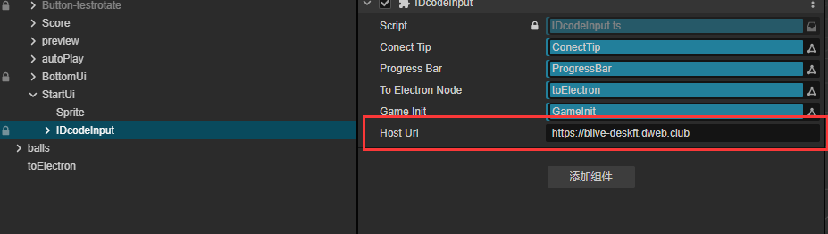
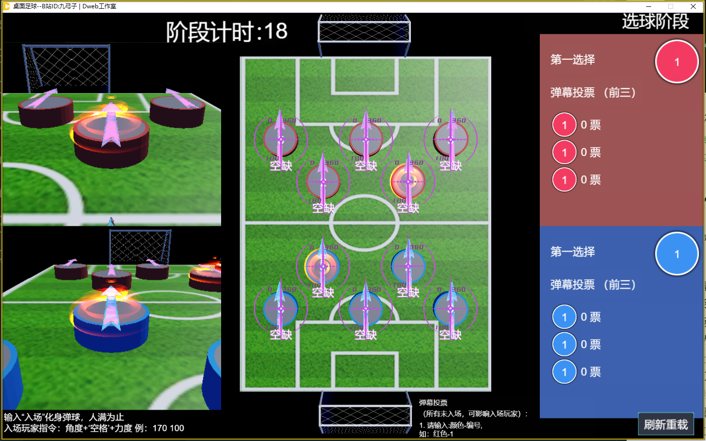

## 桌面足球

### 1.项目环境与安装
  1. Electron客户端（deskft-client）

    cd deskft-client
    npm install
    npm run dev //启动vue3开发环境
    //新建终端
    //启动electron开发环境
    npm run electron -- -room_id=your_room_id -code=your_code
    //-room_id是主播直播间号，-code是主播身份码

  2. 服务端（deskft-server）
      
    //Django项目，没有django和依赖需要自行安装
    cd deskft-server 
    python manage.py runserver

  3. Cocos游戏项目
      
    前往cocos官方下载最新3.8.x版本
    打开Cocos Dashboard，
    导入项目--路径deskft-cocos项目
    即可打开

  4. 服务端地址更换
  项目内默认服务端地址均为：https://blive-deskft.dweb.club
  Cocos项目内全局搜索，替换为你的服务端地址
  CocosCreator中节点组件参数修改你的服务端地址
  

  如果在本地环境构建中还有其他疑问:
  个人主页：https://www.dweb.club
  B站主页：https://space.bilibili.com/22690066
  
  

### 2. 项目介绍

一个可以在B站直播弹幕中的弹球游戏

弹幕踢足球：
玩家可以弹幕输入：入场，参加游戏，人满为止
入场玩家指令：角度+‘空格’+力度，例： 170 100（170度，100力度）
没有参与入场的玩家，可以弹幕投票控制弹球。
弹幕投票分为两个阶段：
1：选球阶段：
弹幕输入：红色-1，
红色1号球即进入主视角选择状态，
最终以票数最高球为主选进入下一阶段
2：弹射参数阶段：
弹幕输入：红色-d7-100 （队伍颜色-坐标-力度）
即为：红色1号球将朝d7坐标以100力度发射
最终以票数最高球为主选进入下一阶段

玩法提示：
弹幕可以控制场上任何一个球，入场玩家同样可以发送弹幕控制
只要弹幕发的够快，玩家就可以控制至多两个球（入场的自己+弹幕投票）
更多的玩家参与（10人上场），体验更佳

【注意】：
1.【刷新重载】清空场上所有玩家，但频繁操作需要等待请求冷却
2.【身份码】会自动填入，如非必要无需输入